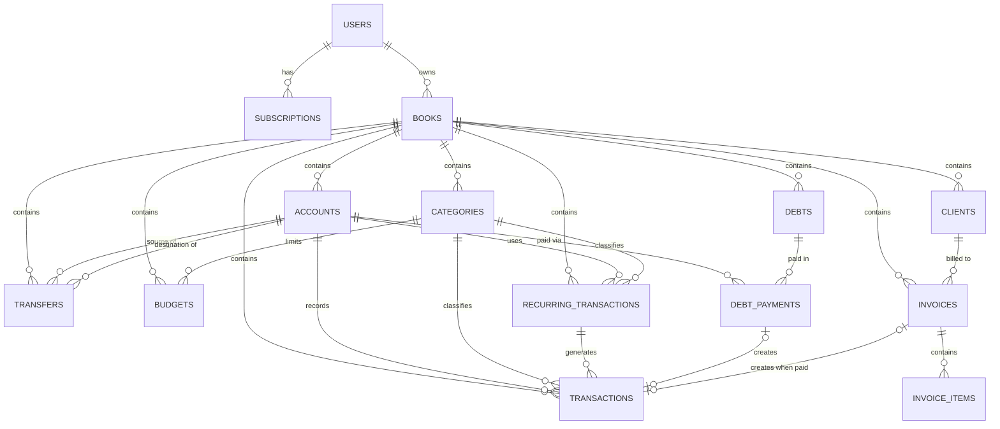

# RakKu — Aplikasi Pencatatan Keuangan
## Dokumen Spesifikasi Teknis

---

## 1. Ringkasan Aplikasi

RakKu adalah aplikasi **pencatatan keuangan (ledger/pembukuan)** — bukan aplikasi e-wallet atau pembayaran. Aplikasi ini **tidak menyimpan atau memindahkan uang sungguhan**; ia murni mencatat angka yang merefleksikan kondisi uang di dunia nyata (cash, rekening bank, e-wallet, dst).

Tahap awal ditujukan untuk penggunaan personal (1 pengguna), dengan arsitektur yang sudah disiapkan agar bisa dikembangkan menjadi produk multi-user di kemudian hari.

**Klarifikasi penting untuk developer:**
- **Akun/dompet** = representasi tempat uang asli berada (cash, BCA, GoPay, dll), bukan dompet digital sungguhan.
- **Transfer antar akun** = pencatatan dua sisi (uang berkurang di satu akun tercatat, bertambah di akun lain), bukan eksekusi pemindahan dana sungguhan.
- **Foto struk** = dokumentasi/bukti pendukung transaksi saja (attachment biasa), **bukan** untuk OCR/pembacaan angka otomatis. Bersifat opsional per transaksi.

---

## 2. Tech Stack

### Web / Admin Panel
- **Laravel** + **Filament**

### Mobile (dikerjakan setelah web/admin stabil)
- **NativePHP for Mobile** (v3 / "Air" — core framework gratis & open source, MIT-licensed)
- Plugin yang dipakai (semua gratis):
  - `Camera` — ambil foto struk
  - `File` — simpan & kelola file (foto struk, hasil export)
  - `Share` — kirim invoice PDF / laporan ke WhatsApp, email, dll
- **Reminder jatuh tempo utang-piutang**: gunakan plugin **komunitas** untuk local notification (mis. `phnuestro/local-notifications` atau `ikromjon/nativephp-mobile-local-notifications`) — bukan plugin resmi `nativephp/mobile-local-notifications` yang berbayar (bagian bundle premium). Cek plugin yang paling aktif di-maintain saat mulai implementasi karena ekosistemnya masih baru.
- **PDF invoice**: library PHP biasa (mis. `barryvdh/laravel-dompdf`), bukan plugin NativePHP — generate PDF berjalan normal karena NativePHP menjalankan PHP sungguhan.
- Tidak dibutuhkan: plugin Push Notifications, Biometrics, Secure Storage, Scanner (di luar scope fitur saat ini).

---

## 3. Model Akses & Monetisasi

Model **freemium**, ditentukan lewat tabel `subscriptions` (kolom `plan`: `free` / `premium`). Pembagian fitur free vs premium mengikuti pembagian Fase 1 / Fase 2 (lihat bagian 4).

**Penting:** Jangan bangun payment gateway/recurring billing di awal. Cukup siapkan skema (`plan`, `status`, `expires_at`), gating fitur berbasis `$user->isPremium()`. Aktivasi premium tahap awal dilakukan **manual** (admin toggle via Filament), otomatisasi billing (Midtrans/Xendit) menyusul belakangan setelah ada demand nyata.

| Fitur | Free | Premium |
|---|---|---|
| Multi-akun/dompet + transfer | ✅ | ✅ |
| Transaksi + kategori + foto struk | ✅ | ✅ |
| Laporan cash flow | ✅ | ✅ |
| Budget per kategori (tanpa alert) | ✅ | ✅ |
| Insight dasar (kategori terbesar) | ✅ | ✅ |
| Export CSV sederhana | ✅ | ✅ |
| Buku pertama (default) | ✅ | ✅ |
| Utang-piutang + reminder | ❌ | ✅ |
| Invoice custom + export PDF | ❌ | ✅ |
| Laporan laba-rugi | ❌ | ✅ |
| Transaksi berulang (recurring) | ❌ | ✅ |
| Budget dengan alert/notifikasi | ❌ | ✅ |
| Insight lanjutan (tren & perbandingan) | ❌ | ✅ |
| Export Excel format lengkap | ❌ | ✅ |
| Buku tambahan (ke-2 dst) | ❌ | ✅ |

---

## 4. Daftar Fitur per Fase

### Fase 1 — MVP
1. Multi-akun/dompet + transfer antar akun
2. Transaksi (income/expense) + kategori + lampiran foto struk (opsional)
3. Laporan cash flow (bulanan/tahunan + grafik tren)
4. Budget per kategori (limit bulanan, tanpa alert)
5. Insight dasar (kategori pengeluaran terbesar, dll)
6. Export data ke CSV
7. Buku (ledger) pertama — dibuat otomatis sebagai default saat user daftar

### Fase 2 — Lengkap
8. Utang-piutang (piutang & utang) + reminder jatuh tempo + cicilan/pembayaran parsial
9. Invoice custom (client, item, harga) + export PDF + status (draft/terkirim/lunas/telat)
10. Laporan laba-rugi
11. Transaksi berulang (recurring) — gaji, tagihan rutin, dll
12. Budget dengan alert saat mendekati/lewat limit
13. Insight lanjutan (perbandingan bulan ke bulan, tren)
14. Export ke Excel format lengkap
15. Buku tambahan (multi-buku, mis. "Pribadi" + "Nadi's Fotocopy")

### Fase 3 — Siap Publish (belum tercakup di skema database bagian 5)
- Autentikasi & billing otomatis untuk multi-user publik
- Mobile app (NativePHP)

---

## 5. Skema Database

### Hierarki data
```
User → Buku (Books) → Akun / Kategori → Transaksi
```

### 5.1 `users`
Tabel standar Laravel (id, name, email, password, dst) + relasi ke `subscriptions` dan `books`.

### 5.2 `subscriptions`
| Kolom | Tipe | Keterangan |
|---|---|---|
| id | bigint, PK | |
| user_id | bigint, FK → users.id | |
| plan | enum('free','premium') | default 'free' |
| status | enum('active','expired','cancelled') | default 'active' |
| started_at | timestamp | |
| expires_at | timestamp, nullable | |
| created_at, updated_at | timestamp | |

### 5.3 `books`
| Kolom | Tipe | Keterangan |
|---|---|---|
| id | bigint, PK | |
| user_id | bigint, FK → users.id | |
| name | string | mis. "Pribadi", "Nadi's Fotocopy" |
| is_default | boolean | default false — true untuk buku pertama |
| created_at, updated_at | timestamp | |

### 5.4 `accounts`
| Kolom | Tipe | Keterangan |
|---|---|---|
| id | bigint, PK | |
| book_id | bigint, FK → books.id | |
| name | string | mis. "Cash", "BCA", "GoPay" |
| type | enum('cash','bank','e-wallet','other') | |
| initial_balance | decimal(15,2) | saldo awal saat akun dibuat |
| current_balance | decimal(15,2) | **di-cache**, di-update tiap ada transaksi/transfer baru |
| created_at, updated_at | timestamp | |

### 5.5 `categories`
| Kolom | Tipe | Keterangan |
|---|---|---|
| id | bigint, PK | |
| book_id | bigint, FK → books.id | di-scope per buku, bukan global |
| name | string | |
| type | enum('income','expense') | |
| created_at, updated_at | timestamp | |

### 5.6 `transactions`
| Kolom | Tipe | Keterangan |
|---|---|---|
| id | bigint, PK | |
| book_id | bigint, FK → books.id | denormalized untuk kemudahan query/scoping |
| account_id | bigint, FK → accounts.id | |
| category_id | bigint, FK → categories.id, nullable | |
| type | enum('income','expense') | transfer TIDAK masuk di sini, lihat 5.7 |
| amount | decimal(15,2) | selalu positif, arah ditentukan `type` |
| description | text, nullable | |
| receipt_photo_path | string, nullable | path foto struk |
| transaction_date | date | |
| recurring_transaction_id | bigint, FK → recurring_transactions.id, nullable | terisi jika hasil generate otomatis |
| created_at, updated_at | timestamp | |

### 5.7 `transfers`
Sengaja dipisah dari `transactions` agar laporan laba-rugi/cash flow tidak salah hitung (transfer itu netral, bukan income/expense).

| Kolom | Tipe | Keterangan |
|---|---|---|
| id | bigint, PK | |
| book_id | bigint, FK → books.id | |
| from_account_id | bigint, FK → accounts.id | |
| to_account_id | bigint, FK → accounts.id | |
| amount | decimal(15,2) | |
| description | text, nullable | |
| transfer_date | date | |
| created_at, updated_at | timestamp | |

### 5.8 `budgets`
| Kolom | Tipe | Keterangan |
|---|---|---|
| id | bigint, PK | |
| book_id | bigint, FK → books.id | |
| category_id | bigint, FK → categories.id | |
| amount | decimal(15,2) | limit bulanan (berlaku terus, bukan per-periode) |
| alert_enabled | boolean | default false — Fase 2 |
| alert_threshold_percent | integer, nullable | mis. 80 = alert di 80% terpakai |
| created_at, updated_at | timestamp | |

> **Catatan:** hanya menyimpan satu limit "berlaku terus" per kategori, bukan limit berbeda tiap bulan. Sengaja disederhanakan untuk MVP.

### 5.9 `recurring_transactions`
| Kolom | Tipe | Keterangan |
|---|---|---|
| id | bigint, PK | |
| book_id | bigint, FK → books.id | |
| account_id | bigint, FK → accounts.id | |
| category_id | bigint, FK → categories.id, nullable | |
| type | enum('income','expense') | |
| amount | decimal(15,2) | |
| description | text, nullable | |
| frequency | enum('daily','weekly','monthly','yearly') | |
| start_date | date | |
| next_run_date | date | dicek scheduler Laravel harian |
| end_date | date, nullable | |
| is_active | boolean | default true |
| created_at, updated_at | timestamp | |

### 5.10 `debts` (utang-piutang)
| Kolom | Tipe | Keterangan |
|---|---|---|
| id | bigint, PK | |
| book_id | bigint, FK → books.id | |
| type | enum('receivable','payable') | receivable = piutang, payable = utang |
| counterparty_name | string | nama pemberi/penerima utang |
| amount | decimal(15,2) | jumlah awal |
| remaining_amount | decimal(15,2) | berkurang tiap ada `debt_payments` |
| due_date | date, nullable | |
| description | text, nullable | |
| status | enum('unpaid','paid') | default 'unpaid' |
| reminder_enabled | boolean | default true |
| created_at, updated_at | timestamp | |

### 5.11 `debt_payments`
| Kolom | Tipe | Keterangan |
|---|---|---|
| id | bigint, PK | |
| debt_id | bigint, FK → debts.id | |
| account_id | bigint, FK → accounts.id | akun yang menerima/membayar cicilan |
| transaction_id | bigint, FK → transactions.id, nullable | auto-generate saat payment dicatat |
| amount | decimal(15,2) | |
| payment_date | date | |
| notes | text, nullable | |
| created_at, updated_at | timestamp | |

### 5.12 `clients`
| Kolom | Tipe | Keterangan |
|---|---|---|
| id | bigint, PK | |
| book_id | bigint, FK → books.id | |
| name | string | |
| email | string, nullable | |
| phone | string, nullable | |
| address | text, nullable | |
| created_at, updated_at | timestamp | |

### 5.13 `invoices`
| Kolom | Tipe | Keterangan |
|---|---|---|
| id | bigint, PK | |
| book_id | bigint, FK → books.id | |
| client_id | bigint, FK → clients.id | |
| transaction_id | bigint, FK → transactions.id, nullable | auto-generate saat status jadi 'paid' |
| invoice_number | string, unique per book | |
| issue_date | date | |
| due_date | date | |
| status | enum('draft','sent','paid','overdue') | default 'draft' |
| notes | text, nullable | |
| created_at, updated_at | timestamp | |

### 5.14 `invoice_items`
| Kolom | Tipe | Keterangan |
|---|---|---|
| id | bigint, PK | |
| invoice_id | bigint, FK → invoices.id | |
| description | string | |
| quantity | decimal(10,2) | |
| unit_price | decimal(15,2) | |
| created_at, updated_at | timestamp | |

---

## 6. Entity Relationship Diagram



---

## 7. Catatan Desain Penting

1. **`transfers` dipisah dari `transactions`** — supaya laporan laba-rugi & cash flow tidak salah hitung. Transfer bersifat netral (uang pindah dari kantong sendiri ke kantong sendiri), berbeda dari income/expense yang benar-benar mengubah kekayaan.

2. **`book_id` di-denormalize di semua tabel turunan** (bukan hanya nyambung lewat `account_id`) — mempermudah query & scoping di Filament (`where book_id = current_book` tanpa join berlapis).

3. **`subscriptions` tabel terpisah, bukan kolom di `users`** — supaya ada riwayat & tanggal expire tersimpan, siap dipakai saat integrasi payment gateway sungguhan nanti.

4. **`debt_payments` & `invoices` sama-sama bisa membuat baris di `transactions`** — setiap kali piutang dicicil atau invoice dilunasi, otomatis generate satu baris transaksi. Tujuannya: semua pergerakan uang riil tetap hidup di satu tempat (`transactions`), sehingga laporan cash flow & laba-rugi selalu akurat tanpa perlu menggabungkan banyak tabel setiap generate laporan.

5. **`accounts.current_balance` adalah angka ter-cache** — di-update setiap ada transaksi/transfer baru, bukan dihitung ulang dari total semua histori transaksi setiap kali dibuka (soal performa).

6. **`categories` di-scope per buku**, bukan global — supaya kategori bisnis (mis. "Bahan Baku") tidak bercampur dengan kategori pribadi (mis. "Makan"). Disarankan seed kategori default saat buku baru dibuat.

7. **Struktur `budgets` disederhanakan** — hanya satu limit "berlaku terus" per kategori, bukan limit berbeda tiap periode/bulan. Jika nanti dibutuhkan riwayat budget per bulan, struktur ini perlu disesuaikan.
